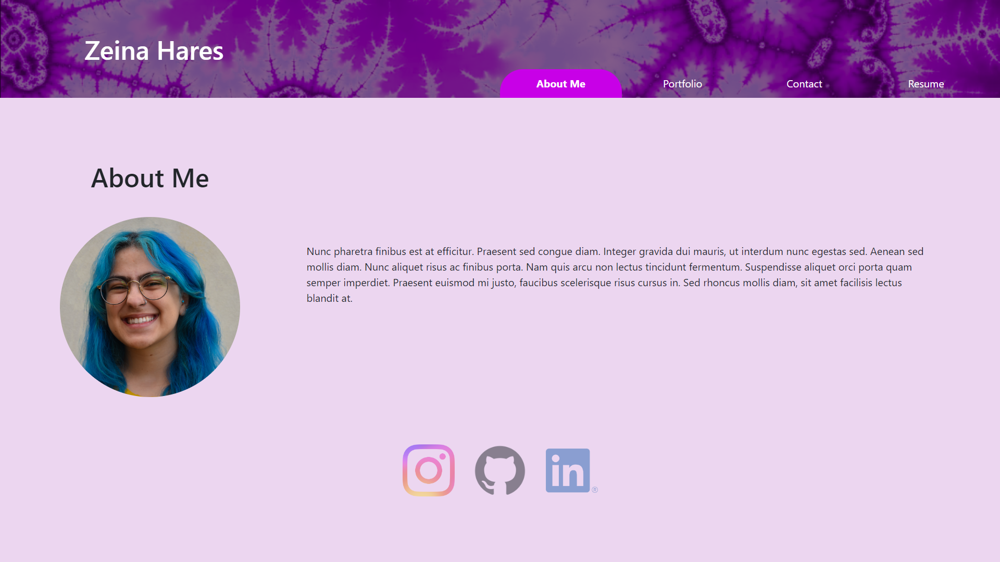

# Portfolio

## Link to My Portfolio
https://zeinahares.github.io/Portfolio/

## Description
I wanted to create a website to host a portfolio of all my work and my resume.

## Table of contents
- [Installation](#installation)
- [Usage](#usage)
- [License](#license)
- [Contribution](#contribution)
- [Tests](#tests)
- [Questions](#questions)
 

## Installation
N/A

## Usage
Click through the tabs to see different pages of the site. On the portfolio page, hover over the image to see the project title, technologies used, and a github logo that links to the repo of the project. If you click on the image of the site it will take you to the deployed site. Feel free to try to contact me in the contact page.  You cannot leave the textbox empty or  enter an invalid email. Currently the submissions are not saved (work in progress). Feel free to download my resume by clicking the link in the resume tab. 

## License
MIT License https://opensource.org/licenses/MIT

    Copyright (c) 2023 zeinahares
    
    Permission is hereby granted, free of charge, to any person obtaining a copy of this software and associated documentation files (the "Software"), to deal in the Software without restriction, including without limitation the rights to use, copy, modify, merge, publish, distribute, sublicense, and/or sell copies of the Software, and to permit persons to whom the Software is furnished to do so, subject to the following conditions:
    
    The above copyright notice and this permission notice shall be included in all copies or substantial portions of the Software.
    
    THE SOFTWARE IS PROVIDED "AS IS", WITHOUT WARRANTY OF ANY KIND, EXPRESS OR IMPLIED, INCLUDING BUT NOT LIMITED TO THE WARRANTIES OF MERCHANTABILITY, FITNESS FOR A PARTICULAR PURPOSE AND NONINFRINGEMENT. IN NO EVENT SHALL THE AUTHORS OR COPYRIGHT HOLDERS BE LIABLE FOR ANY CLAIM, DAMAGES OR OTHER LIABILITY, WHETHER IN AN ACTION OF CONTRACT, TORT OR OTHERWISE, ARISING FROM, OUT OF OR IN CONNECTION WITH THE SOFTWARE OR THE USE OR OTHER DEALINGS IN THE SOFTWARE.

## Contribution
N/A 

## Tests
N/A 
## Questions - 
  
Feel free to reach me for questions at anytime!

  GitHub URL: https://github.com/zeinhares 

  Email Address: zeinahares@gmail.com 
